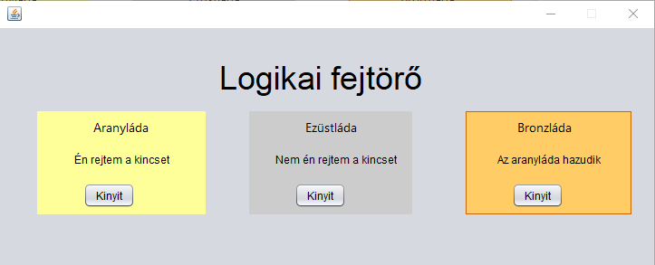

## Logikai fejtörő
Van 3 láda egyik kincset rejt, mindegyiken van egy felirat. Egyik felirat igaz CSAK.

### 3 felirat
arany láda -> Én rejtem a kincset
ezüst láda -> Nem én rejtem a kincset
bronz láda -> Az aranyláda hazudik

Készíts egy git linket és egy readme fileba oszd meg a feladat leírását és megoldását.
grafikus felület kell + program terv

aranyba van A(I)E(I)B(H)
ezüstbe van A(H)E(H)B(I)
bronzba van A(H)E(I)B(I)

Az ezüst láda a megoldás

Ha a felhasználó az ezüst ládát nyitja ki akkor a program felugróablakban gratulál neki.
Ha más opciót választ felugróablakban jelzi a program a felhasználónak hogy nem a kinccsel teli ládát nyitotta ki

